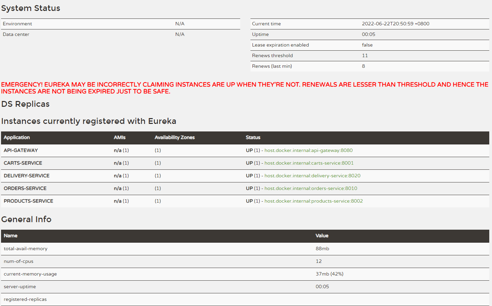
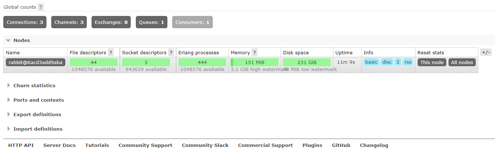
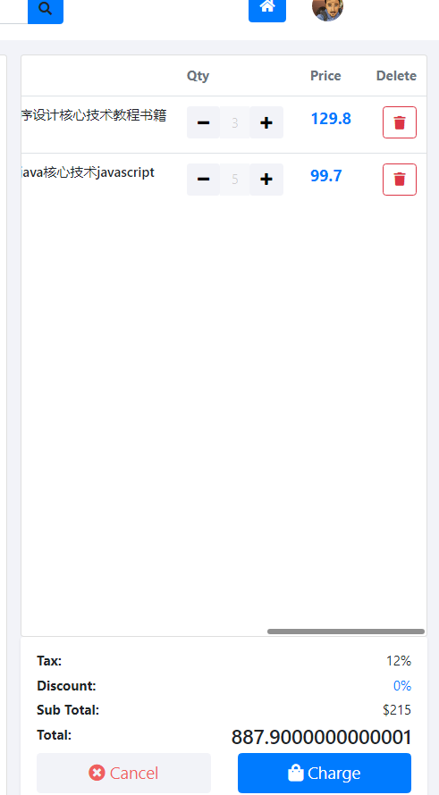
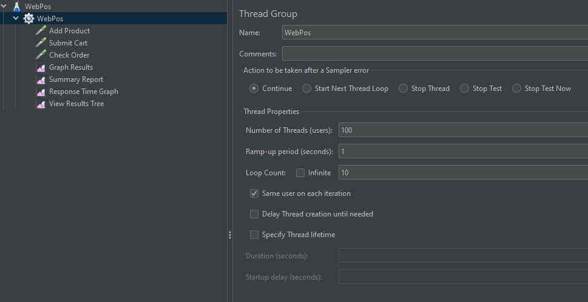
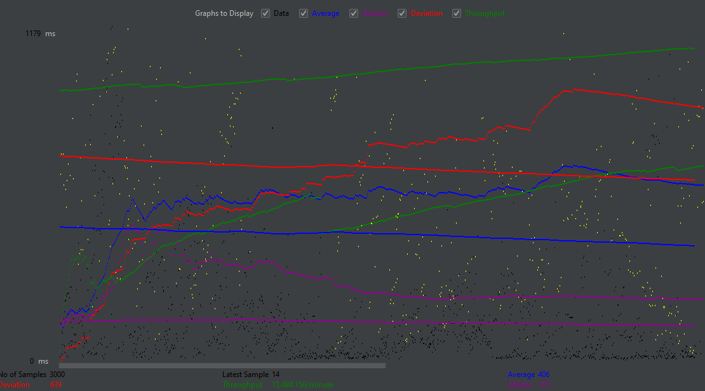
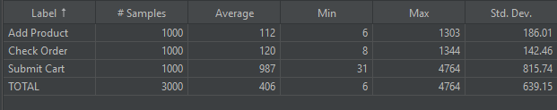
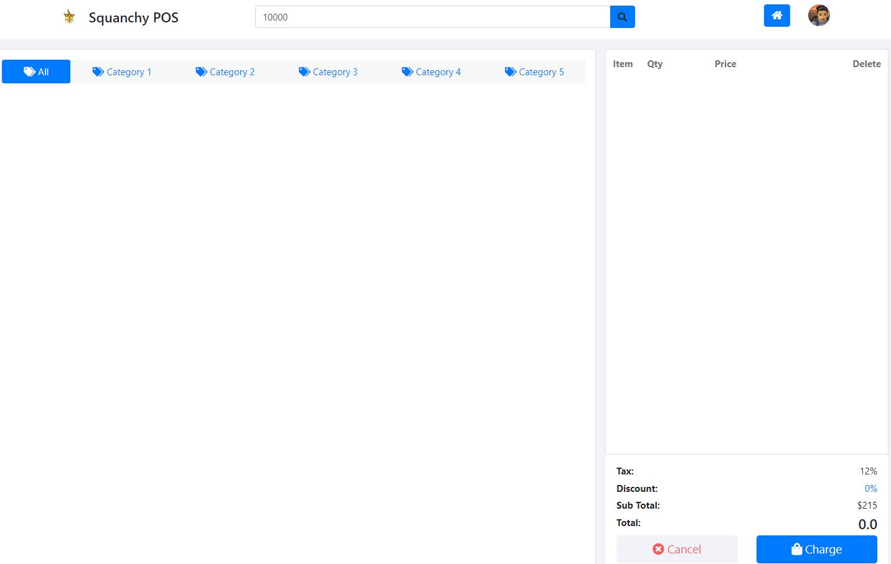

# aw10-final

Please develop a **fully functional** online purchase order system.

- It should have a superb collection of goods merchandises
- Customer can browse/search for merchandises, add selected one into his shopping cart and checkout to complete a transaction.
- User can get delivery status updates continuously.

The system should be of a **reactive architecture**, which means it should be 

-  Responsive: it should response to the user request timely.
-  Resilient: it should not be easily broken down.
-  Elastic: it should be flexible to scale out.
-  Message Driven: it should has loosely coupled components that communicates with each other asynchronously.

Please design tests/experiements to demostrate that your system fulfills such requirements as stated in [The Reactive Manifesto](https://www.reactivemanifesto.org)

**Submit your codes/documents/tests/experiements of your system.**

## 项目简介

结合了前面若干次作业的设计思路和代码，最终采用了微服务架构。

### 参数说明

| 服务类型               | 默认端口 | 推荐启动优先级(越小越优先) |
| ---------------------- | -------- | -------------------------- |
| Discovery Server       | 8761     | 1                          |
| Gateway Server         | 8080     | 2                          |
| Product Server         | 8002     | 3                          |
| RabbitMQ               | 15672    | 3                          |
| Order Server           | 8010     | 4                          |
| Delivery Server        | 8020     | 4                          |
| Cart Server / Frontend | 8001     | 5                          |

### 运行效果

由于我不会其他的前端框架，所以仍然是在以前作业的基础上利用 Themeleaf 尽量完善网页的可用性，使网页能够尽可能利用后端提供的所有功能。

#### Eureka 页面 (6个服务器同时启动)

#### RabbitMQ 页面 (此为已经进行过一些操作后的页面)

#### 初始界面

页面上面的搜索框代表查询订单功能。

#### 添加/删除一些商品

#### 提交订单并得到返回信息

确实草率到家了，不过这个意思没啥问题。。。

另外提交订单后购物车会被清空，这里略去。

#### 查询订单号是否已被 Delivery 接收并处理

以上就是大致流程。虽然看起来很简单但实际上是很多服务一起协同完成的。

### 项目结构

#### 项目流程

基本是之前作业建模的交互模型，除去 gateway 和 discovery 两个服务以外的流程如下：

#### 文件结构

* `pos-delivery`：Delivery Service，提供订单管理和查询服务
* `pos-discovery`：Eureka 注册服务器
* `pos-frontend`：Cart Service，同时提供前端静态网页渲染 (Controller)
* `pos-gateway`：网关服务器，统一接口，路由转发
* `pos-orders`：Order Service，提供订单生成服务
* `pos-products`：Product Service，提供产品信息服务

* `script`：含 RabbitMQ 的 docker-compose 配置文件与运行/终止脚本

### 项目性质

#### 高响应性

利用 JMeter 进行简单测试，配置如下，主要有三个操作。

| 操作类型    | 说明         |
| ----------- | ------------ |
| Add Product | 添加一个商品 |
| Submit Cart | 提交购物车   |
| Check Order | 检查订单状态 |

结果：

可见在高压力情况下仍然有可以接受的性能，响应时间基本处于可以接受的状态。

实际上在项目中关于常用的网络请求（主要是 Products 的获取）进行了 Cache，一定程度上提高了性能。

#### 可靠性

这里讨论服务崩掉的情况。

| 服务类型               | 宕机结果                                                     |
| ---------------------- | ------------------------------------------------------------ |
| Discovery Server       | 网关会宕机，整个集群对外的封装将失效，各服务处于找不到 Eureka 服务器的情况；但一个服务直接访问其他服务的端口仍然可以正常工作，即不会导致各服务宕机 |
| Gateway Server         | 整个集群对外的封装将失效，但不影响各个服务的单独工作，也可以直接访问各服务端口进行交互 |
| Product Server         | Cart Server(前端) 将无法获取产品列表，无法对购物车进行添加产品操作；但不会影响 Order Server 和 Delivery Server，不影响订单提交和检查 |
| RabbitMQ               | Order Server 将无法将用户的订单提交到 Delivery Server，不影响其他交互和各服务的独自运行 |
| Order Server           | Cart Server(前端) 将无法提交购物车生成订单，不影响其他交互和各服务的独自运行 |
| Delivery Server        | Cart Server(前端) 将无法检查订单，Order Server 无法将订单提交给 Delivery Server，不影响其他交互和各服务的独自运行 |
| Cart Server / Frontend | 前端无法运行，各其他后端服务的 api 接口正常运行              |

举例说明，假如 Product Server 崩掉，由于前端界面的展示默认是需要产品列表的，所以正常情况下前端会完全崩溃，即使 Order Server 和 Delivery Server 运行正常也无法通过前端页面调用（因为在调取数据时访问 Product Server 会出现 Exception，导致返回 HTTP Error）。

但这里为了高可靠性，**使用了断路器机制**，即使访问不到 Product Server 也不会出现 HTTP 错误。

所以各个服务崩掉并不会导致整个集群体系崩溃，而失效后快速恢复该服务后一切将恢复正常，只是没有实现失效缓存机制，某个服务崩溃时丢失的信息将不会被记录。

#### 弹性

由于各个 Spring 项目是互相分离的，所以它们在运行环境上是互不依赖的。这会让人很自然地想到可以利用 Docker + Docker Swarm + Docker Compose 或 Kubernetes 进行辅助性服务编排，以达到扩缩容效果。Gateway Server 实现了一定程度上的负载均衡，所以该项目运行起来的水平弹性可以是很好的。

垂直弹性上这里不作讨论。

#### 消息驱动

* Order Service 接收购物车后生成订单，通过 RabbitMQ 将消息传递到 Delivery Service，这一过程是消息驱动的；
* 其他的服务间交互基本都是前后端阻塞的 HTTP 访问，很难做成异步。